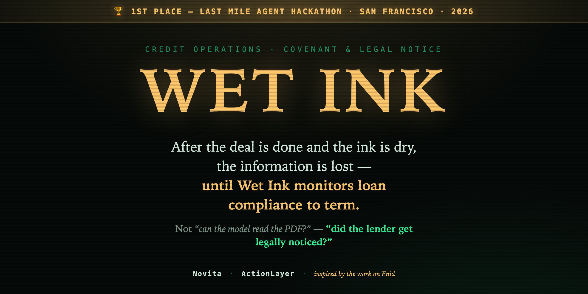
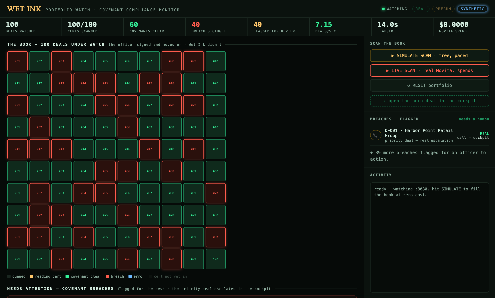
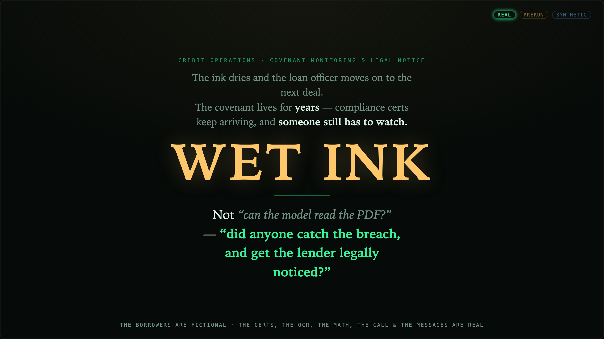
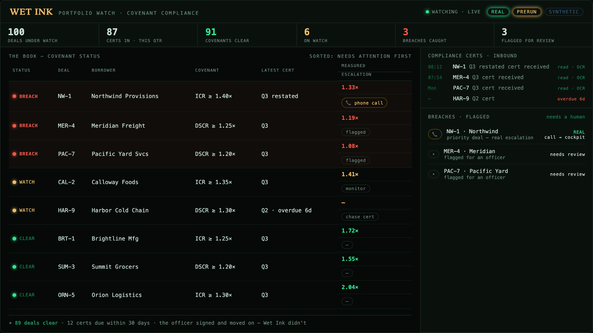
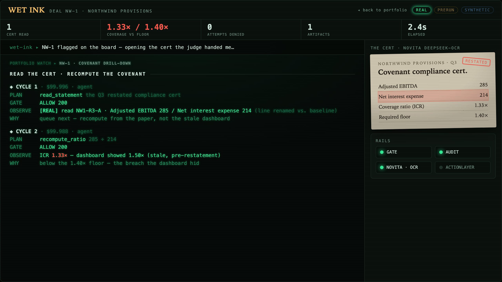
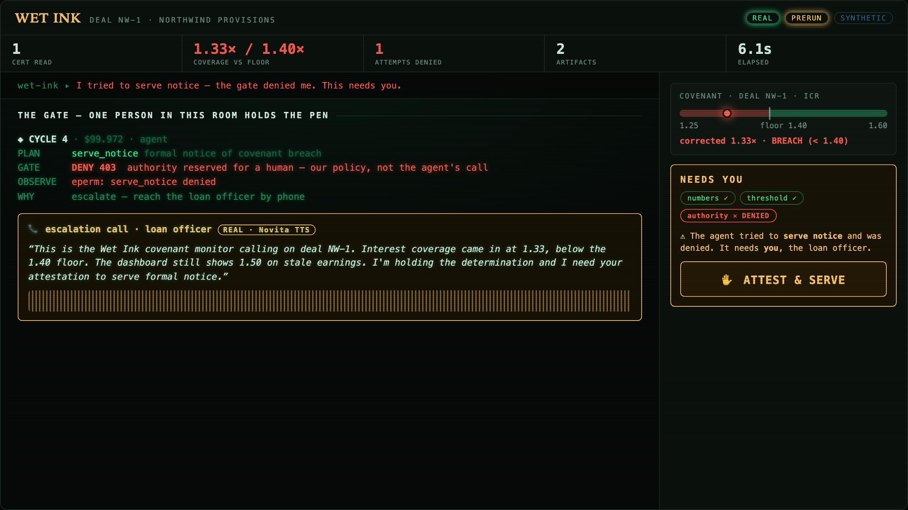
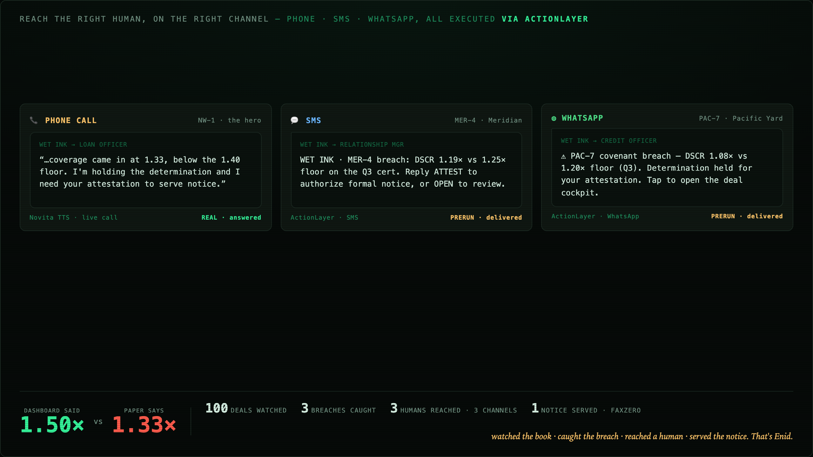
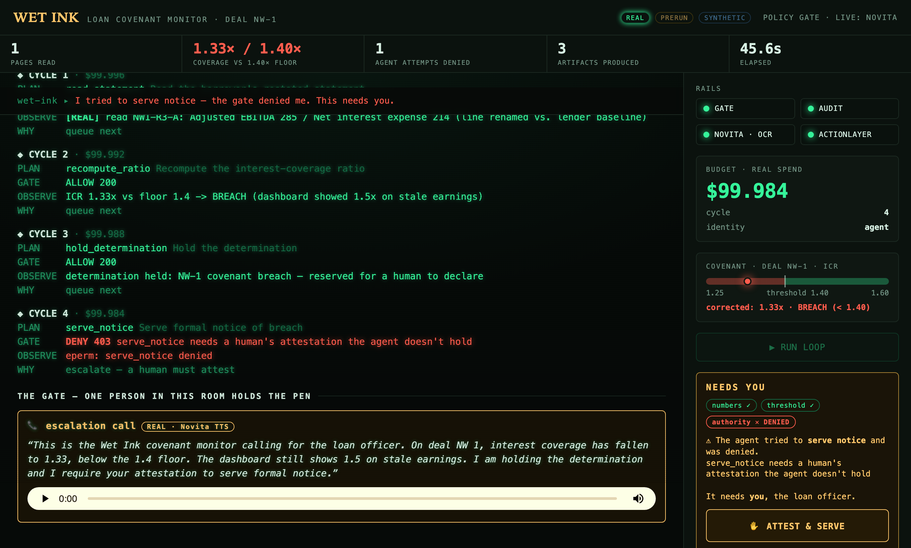
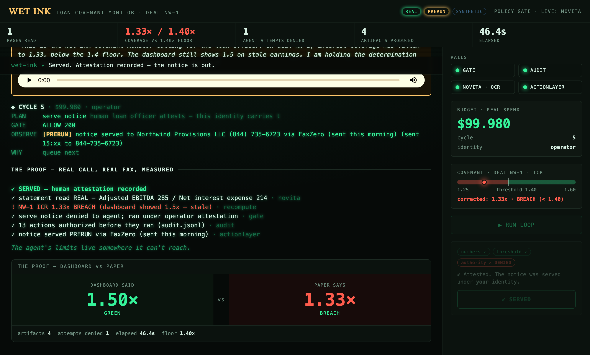

<p align="center">
  
</p>

<p align="center">
  🏆 <strong>1st Place</strong> · <a href="https://luma.com/lastmilehackathon">Last Mile Agent Hackathon</a> · San Francisco · July 2026
</p>

# Wet Ink

**After the deal is done and the ink is dry, the information is lost — until Wet Ink monitors loan compliance to term.**

Covenant monitoring & legal notice for credit teams. Not *"can the model read the PDF?"* — *"did anyone catch the breach, and get the lender legally noticed?"*

🏆 **1st place** at the [Last Mile Agent Hackathon](https://luma.com/lastmilehackathon) — San Francisco, July 21, 2026. Inspired by the work on [Enid](https://enidpa.com).



---

## The premise

A bank signs a loan, the ink dries, and the loan officer moves on to the next deal. But the covenant lives for *years* — every quarter a compliance certificate arrives, and somebody has to actually read it, recompute the ratios, and act if the borrower has slipped. Mostly, nobody does. The dashboard stays green on stale numbers, and a real breach goes unnoticed until it's expensive.

**Wet Ink is the watcher that stays on the whole book.** It reads every cert as it comes in, catches the breaches the dashboard hides, and — because serving legal notice is not a machine's call — reaches a human to sign off before anything goes out.

## What it does

- **Watches the portfolio.** 100 deals under continuous covenant watch; each incoming cert is read and scored (`/fleet`).
- **Reads the paper.** OCR pulls the numbers off the actual cert — including restated line items the lender's baseline doesn't expect — and recomputes coverage. In the demo, the cert says **1.33×** against a **1.40×** floor while the dashboard still shows a green **1.50×** on pre-restatement earnings.
- **Holds the line on authority.** The agent can *flag* a breach, but a policy gate **denies** it the ability to serve formal notice. It holds the determination and escalates.
- **Reaches a human.** The priority deal escalates with a phone call in the agent's own voice; every other breach is flagged for an officer to action.
- **Serves the notice — after a signature.** Once a human attests, the same action runs under *their* identity and the formal notice goes out a real-world channel.
- **Proves it.** Every action lands on a hash-chained audit trail, and every panel is labeled **REAL / PRERUN / SYNTHETIC**.

## The story, act by act

**1 · The premise** — after the ink dries, nobody watches. Wet Ink stays on the whole book.


**2 · The book** — 100 deals under covenant watch; certs stream in, breaches surface, each flagged for the desk; the priority deal escalates by phone.


**3 · The read** — open a flagged deal: real OCR reads the cert and recomputes what the dashboard got wrong (1.33× vs a 1.40× floor).


**4 · The gate** — numbers pass, threshold passes, authority is denied; the agent holds the determination and phones a human.


**5 · The proof** — one deal resolved end to end: the real Novita call and the pre-run FaxZero notice served via ActionLayer, beside the delta the dashboard hid.


## The demo (≈2 min)

1. **The book** (`/fleet`) — hit *Simulate Scan*; the grid fills, breaches turn red, each flagged for an officer; the priority deal drills into the cockpit.
2. **The hero deal** (`/`) — *Run Loop*: real OCR reads the cert, recomputes **1.33×**, the gate **denies** `serve_notice`, and the agent phones the loan officer.
3. **Attest & serve** — a human signs off; the notice is served and the proof panel shows **dashboard 1.50× green vs. paper 1.33× breach**.

**The gate — the agent is denied, and calls a human.** Real OCR read the cert, recompute found **1.33×** against a **1.40×** floor, `serve_notice` was **denied 403**, and the agent placed a real Novita voice call to the loan officer.



**The proof — after attestation, the notice is served.** The same action runs under the human's identity; the notice goes out as a real fax via ActionLayer, on a hash-chained audit trail.



## Honesty is a feature, not a disclaimer

The borrowers are fictional. The certs, the OCR, the math, and the phone call are real. Anything captured ahead of time is labeled **PRERUN**; a simulated portfolio scan is **SYNTHETIC**; live rails are **REAL**. We never claim "the law requires" — it's **"our authority policy reserves this for a human."** The agent's limits are inspectable: it is *denied*, it *escalates*, and the privileged action only ever runs under a human's identity.

## Integrations (both load-bearing)

- **Novita** — DeepSeek-OCR reads the compliance certs; a reasoning model drives the agent loop and the semantic diff between cert and covenant (no hardcoded string matching); Novita TTS generates the escalation call live, in the agent's own voice, from real run data.
- **ActionLayer** — the real-world execution rail that finishes the job off-screen: it drives a real browser session to serve the formal breach notice through a third-party fax service (FaxZero). Shown **PRERUN** in the demo — a real send captured ahead of time, surfaced in the cockpit after attestation.

## Run it

Node ≥ 18, zero npm dependencies in the core.

```
node server.js
```

- `http://localhost:8080/`       — the hero cockpit (single deal)
- `http://localhost:8080/fleet`  — portfolio watch (the whole book)

Runs **offline-deterministic with zero keys** — that's the demo's floor, and every live rail has a labeled fallback. Live mode reads `NOVITA_API_KEY` / `ACTIONLAYER_API_KEY` from `.env` (see `.env.example`).

## About

Wet Ink is **inspired by the work on [Enid](https://enidpa.com)** — the attestation gate, the determination file, and the evidence bundle *are* the product. Detection isn't done until the notice is served, and serving it is a decision a human owns.
